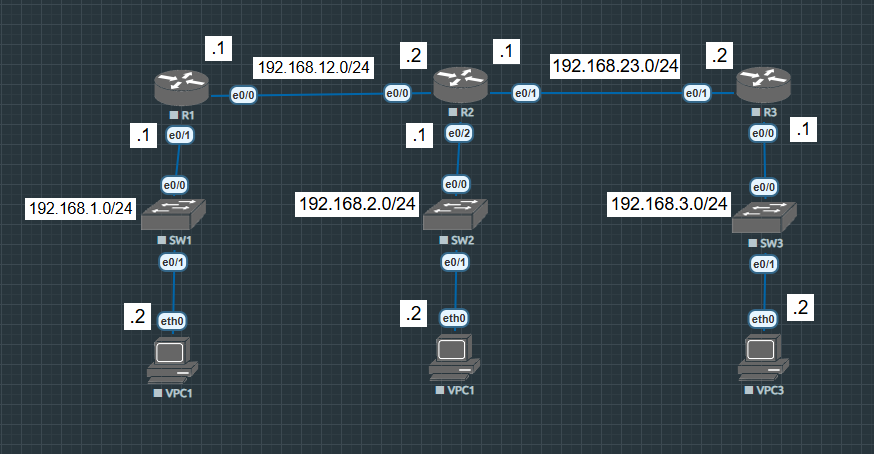

# Lab-02: \[Static route]

## 1. Topology Diagram

## 2. Lab Objectives

* Static route configuration.

## 3. IP Addressing Table

| Device | Interface | IP Address | Subnet Mask |
| :---: | :--- | :--- | :---: |
| R1 | e0/0 | 192.168.12.1 | /24 |
| R1 | e0/1 | 192.168.1.1 | /24 |
| R2 | e0/0 | 192.168.12.2 | /24 |
| R2 | e0/1 | 192.168.23.1 | /24 |
| R2 | e0/2 | 192.168.2.1 | /24 |
| R3 | e0/0 | 192.168.3.1 | /24 |
| R3 | e0/1 | 192.168.23.2 | /24 |
| VPC1 | eth0 | 192.168.1.2 | /24 |
| VPC2 | eth0 | 192.168.2.2 | /24 |
| VPC3 | eth0 | 192.168.3.2 | /24 |

## 4. Configuration Highlights

The core static route command:
ip route (Destination Network IP Address) (Destination Subnet Mask) (Next Hop IP Address) (Administrative Distance)
- Destination Network IP: The network that you want to reach.
- Destination Subnet Mask: The subnet mask of that network.
- Next Hop IP Address: The IP address of the next router's interface.
- Administrative Distance (Optional): If you configure 2 path to 1 destination, it will automatically choose the path that have the lowest number. (Default for static route is 1) - We'll talk about this in later lab.

*To view full configurations, please check the `/configs` folder.*

## 5. Verification Commands

Use these commands to verify the lab status:

show ip route - View the entire routing table.

show ip route static - View specifically the static route in routing table.

show ip interfaces brief - View the IP address of the respective interfaces.

ping (IP Address) - Verify the connection between devices.

traceroute (IP Address) - Track the paths of your packet take to reach the destination.
