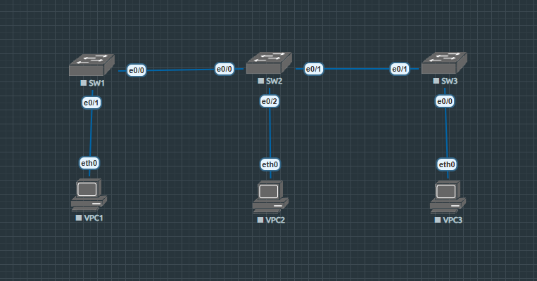

# Lab-04: \[VLAN, Trunking and VTP]

## 1. Topology Diagram

## 2. Lab Objectives

* VLAN creation.

* Trunk port: configure a port to carry multiple VLANs traffic.  

* VTP (VLAN Trunking Protocol): configure a VTP Server and Clients to synchronize VLANs automatically.

## 3. VLAN and VTP database

| VLAN ID | VLAN Name | Network Address |
| :---: | :--- | :---: |
| VLAN 10 | IT | 192.168.10.0/24 |
| VLAN 20 | Sales | 192.168.20.0/24 |
| VLAN 30 | Marketing | 192.168.30.0/24 |

| VTP Domain | VTP Password |
| :---: | :---: |
| ccna | cisco123 |

## 4. Configuration Highlights

Create a VLAN by standing in a Global Config Mode of a Switch and type:
* vlan "vlan id"

Changing switch's interface mode by standing in a Interface Config Mode and type:
* switchport mode trunk/access

Basic VTP setup is standing at Global Config Mode and type:
* vtp mode server(default)/client/transparent
* vtp domain "domain name"
* vtp password "password"

*To view full configurations, please check the `/configs` folder.*

## 5. Verification Commands

Use these commands to verify the lab status:

show vlan - View the VLANs and check the VLAN that assign with each ports.

show interfaces trunk - View the interfaces that configured as a trunk port and VLANs that port allow.

show vtp status - View the information about VTP configuration such as mode, domain name, revision number,...

ping (IP Address) - Verify the connection between devices.
