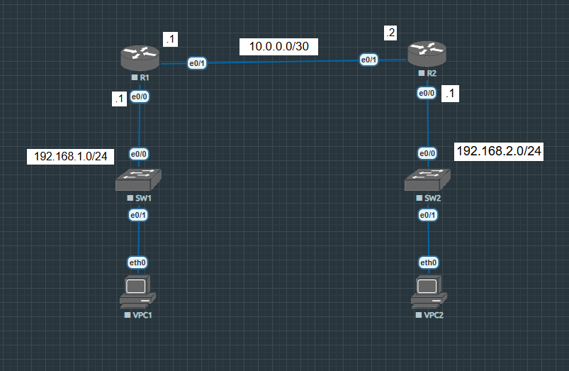

# Lab-07: \[DHCP Relay Agent]

## 1. Topology Diagram

## 2. Lab Objectives

* DHCP Server: Configure a router to be a DHCP Server.

* DHCP Relay Agent: Configure a router to be a DHCP Relay Agent to forward request from client to the DHCP Server.

## 3. IP Addressing Table

| Device | Interface | IP Address | Subnet Mask |
| :---: | :--- | :--- | :---: |
| R1 | e0/1 | 10.0.0.1 | /30 |
| R1 | e0/0 | 192.168.1.1 | /24 |
| R2 | e0/1 | 10.0.0.2 | /30 |
| R2 | e0/0 | 192.168.2.1 | /24 |
| VPC1 | eth0 | DHCP | DHCP |
| VPC2 | eth0 | DHCP | DHCP |

## 4. Configuration Highlights

n/a

*To view full configurations, please check the `/configs` folder.*

## 5. Verification Commands

Use these commands to verify the lab status:

show ip dhcp pool (pool name) - display detailed information about a specific DHCP pool.

show ip dhcp binding - display a list of all IP addresses assigned to clients, including their MAC addresses and lease expiration.

ping (IP Address) - Verify the connection between devices.
